
## XR Interaction Toolkit

### Demo
Launch scene `ImmersiveVRInventoryDemo\Scenes\XRToolkitDemoScene`
> After opening demo scene you could be asked to update TextMeshPro, if that happens you might need to reopen the scene for text to be correctly rendered

### Setup

> As a prerequisite you need to:
> - enable Virtual Reality Support from `Edit -> Project Settings -> Player` menu
> - install `XR Interaction Toolkit` (preview 0.10.0-preview.7)
>   - when asked to use new input system answer 'Yes'
> - start project with HDRP template (if you're not using HDRP please look at section **URP / Unity Legacy Shader**)


**When importing asset for clean build, only import `ImmersiveVRInventory`, `Editor/ImmersiveVRInventory folders` and integration code for framework used eg. `ImmersiveVRInventory/Integrations/XRToolkit`**

1) Create `GameObject` and add `HolsterManager` script to it 
1) Add `XRToolkitTrackableController` script to `GameObjects` with `XRController` scripts, eg. 
     - `LeftHand Controller`,
     - `RightHand Controller`
1) On all instances of `XRTooltipTrackableController`
     - add new handler for `OnGrabStarted`, 
         - put root `HolsterManager` as target object 
         - choose function `HandleGrab (Dynamic)`
     - add new handler for `OnGrabStopped`, 
         - put root `HolsterManager` as target object 
         - choose function `HandleUngrab (Dynamic)`
     - assign `Controller` to current `GameObject` eg `LeftHandController`
1) Add `XRToolkitHolsterableItem` to items that you want to work with the system
1) Add `HolsterHarness` prefab to the scene, which includes backpack and side holsters
    - in `FollowObjectTarget` set `Source` to `GameObject` that tracks player position, eg. `MainCamera`
    - assign `TrackableController` (Left/Right) in `AvailableControllers` for `AdjustmentModeOn` and `AdjustmentModeOff`
    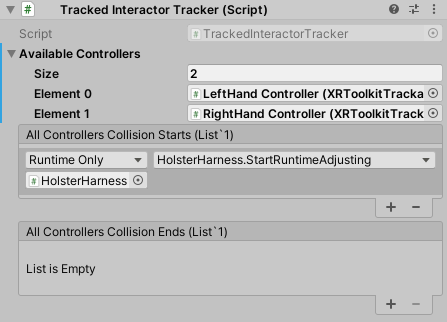
1) (Optional) - add `Backpack` prefab into the scene
   - Set `AutoHolsterSlotOnUngrab` on `HolsterableItem` to `HolsterHarness/BackpackSlot/Slot`

<div style="page-break-after: always;"></div>

## SteamVR
> Make sure you have SteamVR already imported.

1) Run demo scene using wecome window
1) or create new scene and 
2) Add `Player` prefab from `SteamVR`
3) Create `GameObject` and add `HolsterManager` script to it 
4) On both `Player/SteamVRObjects/LeftHand` and `Player/SteamVRObjects/RightHand`
    - add new handler for `OnGrabStarted`, 
         - put root `HolsterManager` as target object 
         - choose function `HandleGrab (Dynamic)`
     - add new handler for `OnGrabStopped`, 
         - put root `HolsterManager` as target object 
         - choose function `HandleUngrab (Dynamic)`
     - assign `Controller` to current `GameObject` eg `LeftHand`
     - adjust `SphereCollider` to be smaller, otherwise it'll easily collide with backpack other slots (suggested **`Radius = 0.08`**)
5) Add `SteamVRHolsterableItem` to items that you want to work with the system
6) Add `HolsterHarness` prefab to the scene, which includes backpack and side holsters
    - in `FollowObjectTarget` set `Source` to `GameObject` that tracks player position, eg. `MainCamera`
    - assign `TrackableController` (Left/Right) in `AvailableControllers` for `AdjustmentModeOn` and `AdjustmentModeOff`
7) (Optional) - add `Backpack` prefab into the scene
   - Set `AutoHolsterSlotOnUngrab` on `HolsterableItem` to `HolsterHarness/BackpackSlot/Slot`


## Microsoft Mixed Reality Toolkit
- to be added

## Virtual Relity Toolkit
- to be added 

# Framework Independent Configuration

1) Add `TrackableController` scripts to controller objects
    - depending on integration used, eg
        - XRToolkit
        - MRTK Toolkit
        - VRTK Toolkit
    - you can also very easily extend `TrackableController` to work with your custom `Controller` implementation if not using any of the above (please see **Integrating Custom Framework - Code Changes** section below) 
2) Configure `Grab` and `Ungrab` actions to flow into `HolsterManager` 
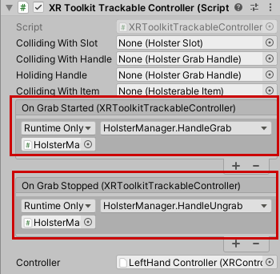
3) Add `HolsterableItem` (or corresponding integration specific version) to items that you want to work with the system
4) Add `HolsterHarness` prefab to the scene, which includes backpack and side holsters
    - attach it to game-object that follows player position
    - add `TrackableController` (Left/Right) for `AdjustmentModeOn` and `AdjustmentModeOn`
5) (Optional) - add `Backpack` prefab into the scene
   - Set `AutoHolsterSlotOnUngrab` to `BackpackSlot > Slot(Clone)`
6) (Optional) On `HolsterHarness` game object for `FollowObjectTransform` script set `Source` to headset following object (eg. for Unity XR - `MainCamera`) 

Now you'll be able to store all items with `HolsterableItem` script in any `HolsterSlot`

## Integrating Custom Framework - Code Changes
If you're not using any framework with integrations created please remove code in `Integrations` folder. Instead create your own `TrackableController` implementation. Sole purpose of this class is to signal when grab action started and stopped. 

You could use template below to help you.

```
public class YourCustomTrackableController : TrackableController
{
    [Serializable] public class UnityEvent : UnityEvent<YourCustomTrackableController>
    {

    }

    public UnityEvent OnGrabStarted = new UnityEvent();
    public UnityEvent OnGrabStopped = new UnityEvent();
   
    private bool _isGrabInProgress;

    void Update()
    {
        var isPressed = <Your code to check if GRAB button is pressed on controller>
        
        if (isPressed)
        {
            if (!_isGrabInProgress)
            {
                _isGrabInProgress = true;
                OnGrabStarted?.Invoke(this);
            }
        }
        else
        {
            if (_isGrabInProgress)
            {
                _isGrabInProgress = false;
                OnGrabStopped?.Invoke(this);
            }
        }
    }
}

```

# Different Rendering Pipelines
Few shaders used in asset are created for HDRP, if your project is using different shader materials will show pink.
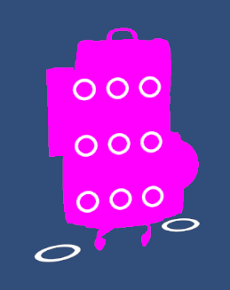

If you like to adjust please follow the steps below.

## URP/Surface Shader Adjustments
Tool should automatically recognize if you're using HDRP / URP / Surface shaders and adjust as needed. If not you can choose `ShaderMode` via Preferences or Start Screen.

# Play-mode customisation

## Holster slots positioning
Once you have your holster harness attached to camera you'll want to adjust their position for ease of use.

It's very convenient to do that in play mode using your headset and controllers. Simply put both hands on `AdjustmentModeOn` game object.
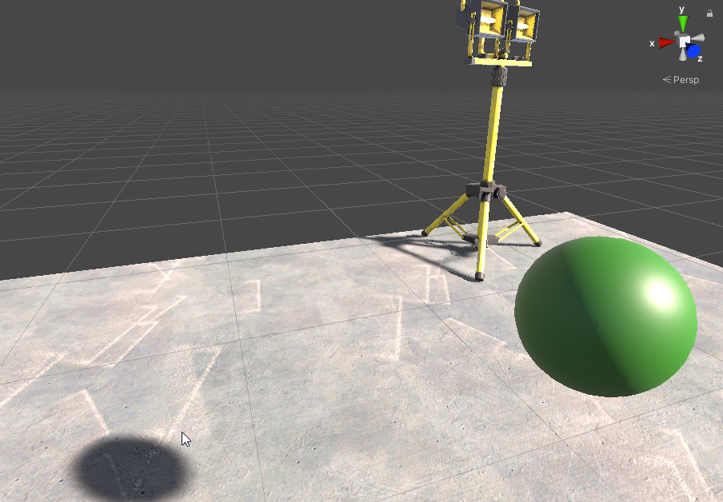

You'll see red-handles visible, simpt grab the one that interests you and place as needed. This will store new preferences.
**To apply those new settings in Editor right click on `HolsterSlotContainer` (with play mode off) and choose `Apply Holster Adjustments As Base`**
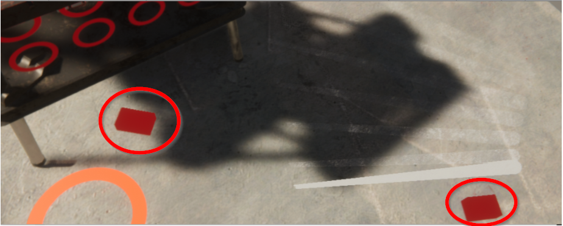

<div style="page-break-after: always;"></div>

# Editor customisation

## Holster Slot Container
Those can be used to create variation of slots in a grid with **n columns** and **n rows** and could be used to create various containers, eg: 
- Backpack
- Waist Holster
- Chest Holster
- Back holster

### Customisation

In edit mode select `Adjust Slots` which will reflect your changes in editor, it does so by recreating slot `GameObjects` changes you have done will be overwritten in that mode.

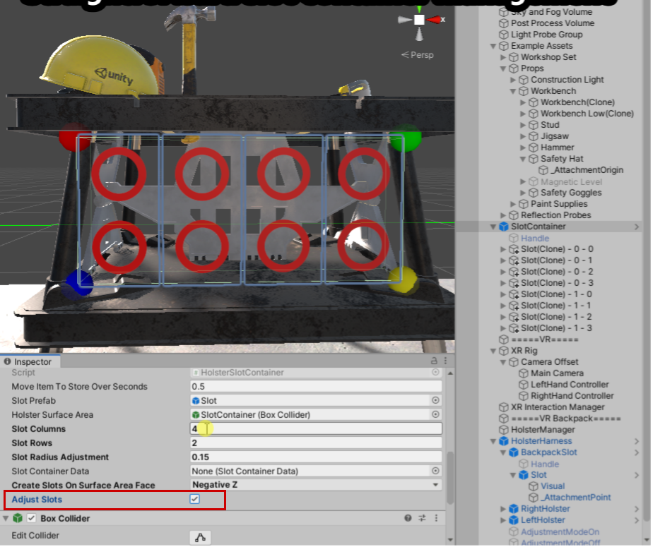

- Position - could be adjusted in play-mode and then applied in Editor via `Apply Holster Adjustments As Base`
- Holster Surface Area - box collider that will be used as a base to where put `HolsterSlots`
- Slot columns / rows - slots will be aligned in a grid based on available space while using columns and rows values to place components
- Slot Radius Adjustment - base radius for single `HolsterSlot`
- Slot Container Data - Scriptable object containg current data, those will be auto created with prefab or could be added using `Reset` via Editor

- Context Menu Actions
  - `Recreate Holster Slots` - will recreate slots based on setup, those can then be further customised as needed
  - `Apply Holster Adjustments As Base` - play-mode ajustments will be applied to scene data
  - `Persist Setup` - current adjustments will be persisted in scriptable object

<div style="page-break-after: always;"></div>

## Holster Slot
Those elements directly store items put into them.

- Ring Radius Animation - animation curve that can be used to specify how ring radius will change when `Active`
- Initially Stored Item - store specific item at start of the scene

### Scaling
Items stored in slots will can adjusted to properly display in slot with `Scale Items To Fit` (this is useful for backpack-like containers)

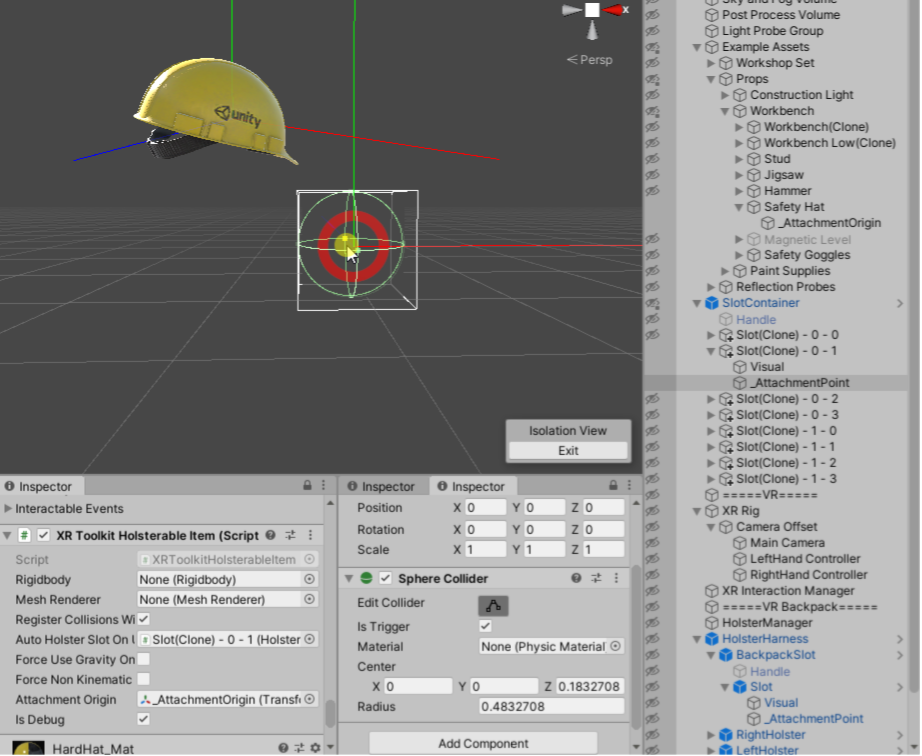

<div style="page-break-after: always;"></div>

### Rotation
When storing items, rotation can be adjusted to properly position within slot, this is very useful for side-holsters when storing single-items. For example a gun should be stored barrel down and grip back.
- `IsDebug` - will render up/forward/right directions for `_AttachmentPoint` (which are used to align with `_AttachmentOrigin` on `HolsterableItem`)
- `_AttachmentPoint` (child object) - change rotation directly to affect how `HolsterObjects` will be rotated when stored

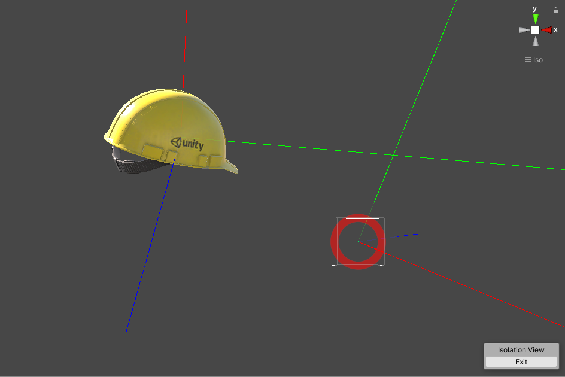

When stored `Holsterable Item` will be rotated for direction lines to align.

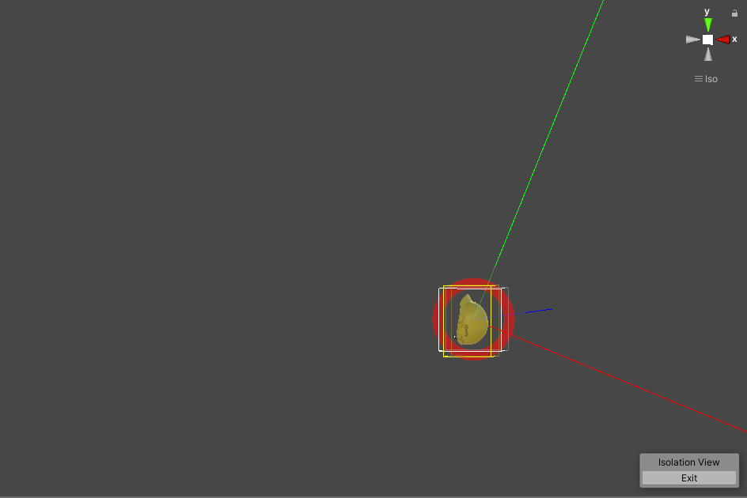

### Limit what can be stored
You can narrow down what can be stored in `HolsterSlot` with `LimitToItemsWithTag` - this will allow to only store items that are marked with specified tag.

## HolsterableItem
This will allow game objects to be holstered / stored in slots.

- `_AttachmentOrigin` (child object) - change rotation directly to adjust how item should be rotated while holstered
- Auto Holster Slot On Ungrab - for some items it makes sense to auto store them when dropped, eg. Backpack should come back to back-holster when ungrabbed. This can be used for any items that user should not lose and have dedicated slot.

- Rigidbody / MeshRenderer - populated automatically and used to caluclate bounds when scaling items to fit within slot, adjust if complex models behave incorrectly
- Register Collisions With Tracked Controller - generally all items that you can put in `HolsterSlot` should register their collisions with `TrackedControllers`. 
The exception being items that can be stored in slots but are moved via `HolsterGragHandle`, eg. `Backpack` can be stored in another `HolsterSlot` (on the back) but should not register collistions as this will lead to invalid grab/ungrab mechanics.

<div style="page-break-after: always;"></div>

# Visual customisation
Asset is focusing on workflow, it uses minimalistic visuals that were designed to be easily replacable.

## Holster Slot
When replacing shader please make sure it has access to `_RingRadius` variable, this is used to animate radius size changing to indicate items can be put in / out.

## Holster Grab Handle
Red cube that indicates where container can be grabbed

## Adjustment mode On / Off
Simple shapes that'll turn on adjustment mode when controllers are put inside of them.

<div style="page-break-after: always;"></div>

# FAQ
1) On demo scene text labels are huge
> If you just Imported TMP you'll need to reopen scene, text will get to correct size

2) I try to use `HolsterableItem` with `AutoHolsterSlotOnUngrab` but on some occasions it doesn't holster the item back.

> This is usually due to  `TrackableController` collider radius being not big enough to catch `HolsterableItem` when being held. It can happen for default SteamVR setup.

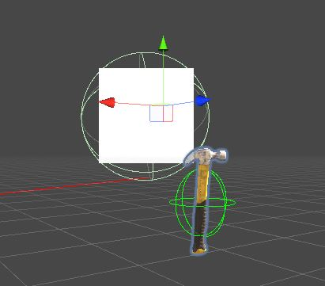
*Controller collider radius is not overlaping with item - when it's ungrabbed it'll not return back to holster.*

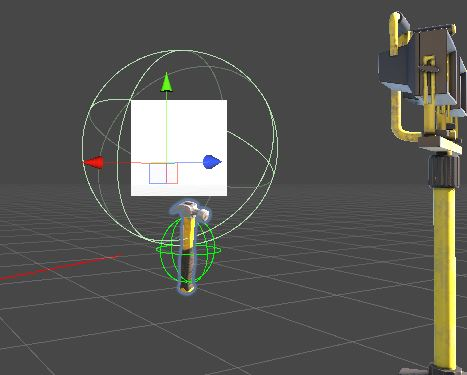
*Collider radius slightly changed to make sure it overlaps with the item*

# Coming soon
- demo scenes with using different VR Frameworks - MRTK / VRTK
- ability to have multiple 'pages' in inventory
- shaders for URP / Unity Legacy Shader